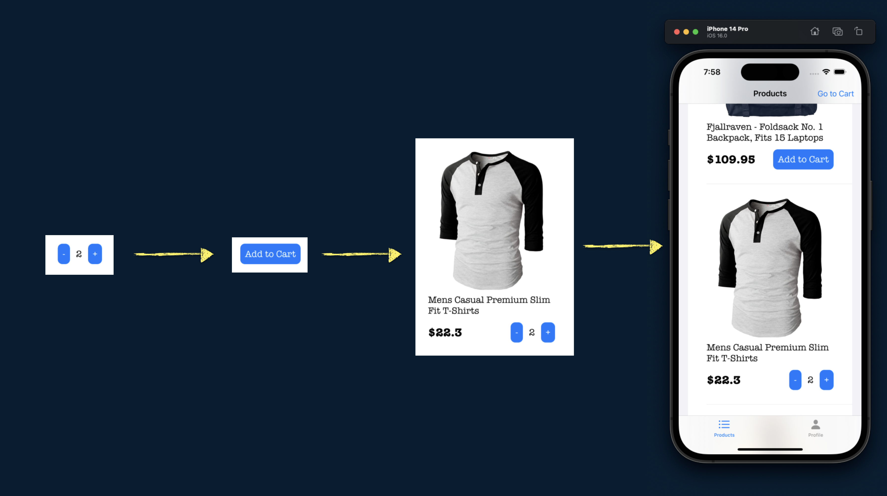
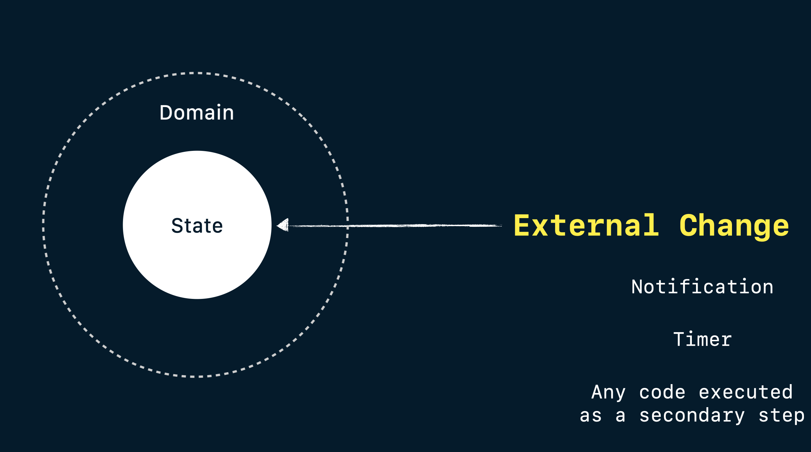
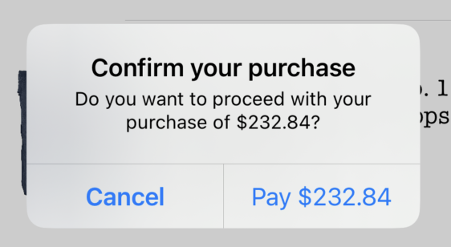

# 목표

- [ ] https://github.com/pitt500/OnlineStoreTCA 베끼기
- [ ] 1주일(2025.06.19 ~ 2025.06.26)동안 학습
- [x] README.md 번역

---

## Content

* [Motivation](#motivation)
* [Screenshots of the app](#screenshots)
* [The basics](#the-basics)
    * [Archiecture Diagram](#archiecture-diagram)
    * [Hello World Example](#hello-world-example)
* [Composition](#composition)
    * [Body to compose multiple Reducers](#body-to-compose-multiple-reducers)
    * [Single state operators](#single-state-operators)
      * [store.scope(state:action:)](#storescopestateaction)
      * [Scope in Reducers](#scope-in-reducers)
    * [Collection of states](#collection-of-states)
      * [forEach in Reducer](#foreach-in-reducer)
* [Dependencies](#dependencies)
* [Side Effects](#side-effects)
    * [Network Calls](#network-calls)
* [Navigation](#navigation)
    * [Alerts](#alerts)
    * [Sheets](#sheets)
* [Testing](#testing)
    * [Basics](#testing-basics)
    * [Side Effects](#testing-side-effects)
    * [CasePathable](#testing-CasePathable)
* [Other Topics](#other-topics)
    * [Optional States](#optional-states)
    * [Private Actions](#private-actions)
    * [Making a Root Domain with Tab View](#making-a-root-domain-with-tab-view)
* [Contact](#contact)

## Motivation

**TL;DR:** This project aims to build an app using TCA, striking a balance between simplicity and complexity. It focuses on exploring the most important use cases of TCA while providing concise and accessible documentation for new learners. The goal is to create a valuable learning resource that offers practical insights into using TCA effectively.  
**요약:** 이 프로젝트는 TCA를 활용하여 단순성과 복잡성의 균형을 맞춘 앱을 개발하는 것을 목표로 합니다. TCA의 가장 중요한 사용 사례를 살펴보는 동시에 신규 학습자를 위해 간결하고 접근하기 쉬운 문서를 제공하는 데 중점을 둡니다. TCA를 효과적으로 사용하는 데 필요한 실질적인 통찰력을 제공하는 귀중한 학습 자료를 만드는 것이 목표입니다. 
 
I aimed to showcase the power of the TCA architecture in building robust applications for the Apple ecosystem, including iOS, macOS, and more excitingly, its future expansion beyond the Apple world! 🚀  
저는 iOS, macOS를 포함한 Apple 생태계에서 강력한 애플리케이션을 구축하는 데 있어 TCA 아키텍처의 힘을 보여주고, 더 나아가 Apple 세계를 넘어 미래로 확장하는 데 있어 TCA 아키텍처의 힘을 보여주고 싶었습니다! 🚀 
 
While there are many articles available that demonstrate simple one-screen applications to introduce TCA's core concepts, I noticed a gap between these basic demos and real-world applications like [isoword](https://github.com/pointfreeco/isowords), which can be complex and challenging to understand certain important use cases (like navigation and how reducers are glued).  
TCA의 핵심 개념을 소개하는 간단한 단일 화면 애플리케이션을 보여주는 문서가 많이 있지만, 이러한 기본 데모와 [isoword](https://github.com/pointfreeco/isowords)와 같은 실제 애플리케이션 사이에 차이가 있다는 것을 발견했습니다. 이러한 실제 애플리케이션은 복잡하고 특정 중요한 사용 사례(예: 탐색 및 리듀서의 결합 방식)를 이해하기 어려울 수 있습니다.  
 
In this demo, I have implemented a minimal online store that connects to a real network API (https://fakestoreapi.com). It features a product list, the ability to add items to the cart, and the functionality to place orders. While the requests are not processed in real-time (as it uses a fake API), the network status is simulated, allowing you to experience the interaction and mapping of network calls using TCA.  
이 데모에서는 실제 네트워크 API(https://fakestoreapi.com)에 연결되는 간단한 온라인 스토어를 구현했습니다. 제품 목록, 장바구니에 상품 추가, 주문 기능을 제공합니다. 요청은 실시간으로 처리되지 않지만(가짜 API를 사용하므로), 네트워크 상태는 시뮬레이션되어 TCA를 사용한 네트워크 호출의 상호작용 및 매핑을 경험할 수 있습니다.  
 
While this demo may not be a full-scale real-world application, it includes enough reducers to illustrate how data can be effectively connected and how domains can be isolated to handle specific components within the app (e.g., Tabs -> Product List -> Product Cell -> Add to Cart button).  
이 데모는 실제 세상의 전체적인 애플리케이션은 아니지만, 데이터를 효과적으로 연결하는 방법과 앱 내의 특정 구성 요소를 처리하기 위해 도메인을 분리하는 방법을 보여주는 데 충분한 리듀서가 포함되어 있습니다(예: 탭 -> 제품 목록 -> 제품 셀 -> 장바구니에 추가 버튼).  
 
Furthermore, I have created tests to demonstrate one of TCA's key features: ensuring that tests fail if the expected state mutations are not captured accurately. This showcases how TCA promotes testability and helps ensure the correctness of your application.  
또한, TCA의 핵심 기능 중 하나인 예상되는 상태 변화가 정확하게 포착되지 않으면 테스트가 실패하도록 하는 테스트를 만들었습니다. 이는 TCA가 테스트 가능성을 높이고 애플리케이션의 정확성을 보장하는 데 어떻게 도움이 되는지 보여줍니다.  
 
If you're looking to dive into TCA, this demo provides a valuable middle ground between simple examples and complex projects, offering concise documentation and practical insights into working with TCA in a more realistic application setting.  
TCA에 대해 자세히 알아보고 싶다면 이 데모는 간단한 예제와 복잡한 프로젝트 사이의 귀중한 중간 지점을 제공하며, 간결한 설명서와 보다 현실적인 애플리케이션 설정에서 TCA를 사용하는 방법에 대한 실질적인 통찰력을 제공합니다.  
 
## Screenshots

### Tabs
||

### Cart
||

## The basics
### Archiecture Diagram


### Hello World Example
Consider the following implementation of a simple app using TCA, where you will have two buttons: one to increment a counter displayed on the screen and the other to decrement it.  
TCA를 사용하여 간단한 앱을 구현해 보겠습니다. 여기에는 두 개의 버튼이 있습니다. 하나는 화면에 표시된 카운터를 증가시키는 버튼이고, 다른 하나는 감소시키는 버튼입니다.  
 
Here's an example of how this app would be coded with TCA:  
다음은 TCA를 사용하여 이 앱을 코딩하는 방법의 예입니다.  
 
1. A struct that will represent the domain of the feature. This struct must conform `ReducerProtocol` protocol and providing `State` struct, `Action` enum and `reduce` method.
<br>기능의 도메인을 나타내는 구조체입니다. 이 구조체는 `ReducerProtocol` 프로토콜을 준수해야 하며 `State` 구조체, `Action` 열거형, 그리고 `reduce` 메서드를 제공해야 합니다. 
 
```swift
struct CounterDomain: ReducerProtocol {
    struct State {
        // 기능의 상태 (State of the feature)
    }

    enum Action {
        // 앱에서 할 수 있는 작업 (actions that use can do in the app)
    }
    
    func reduce(into state: inout State, action: Action) -> EffectTask<Action> {
        // Method that will mutate the state given an action.
        // 동작(action)이 주어졌을 때 상태(state)를 변경하는 메서드입니다.
    }
}
```

2. The view that is presented in the screen will display the current state of the app.
<br>화면에 표시되는 뷰는 앱의 현재 상태(state)를 표시합니다.
<!-- [-] 0 [+] -->


```swift
struct State: Equatable {
    var counter = 0
}
```

3. When the user presses a button (let's say increase button), it will internally send an action to the store.
<br>사용자가 버튼(예를 들어 증가 버튼)을 누르면 내부적으로 스토어에 작업(action)이 전송됩니다.


```swift
enum Action: Equatable {
    case increaseCounter
    case decreaseCounter
}
```
 
4. The action will be received by the reducer and proceed to mutate the state. Reducer MUST also return an effect, that represent logic from the "outside world" (network calls, notifications, database, etc). If no effect is needed, just return `EffectTask.none` .
<br>액션은 리듀서(현재 상태와 액션을 받아 새로운 상태를 반환하는 순수 함수)에 의해 수신되어 상태를 변경합니다. 리듀서는 "외부 세계"(네트워크 호출, 알림, 데이터베이스 등)의 로직을 나타내는 이펙트(effect)도 반환해야 합니다. 이펙트가 필요하지 않으면 `EffectTask.none`을 반환하면 됩니다.
 - 비순수 작업은 이펙트를 통해 따로 실행하게끔 분리
 - 예) 리듀서는 네트워크 요청 자체를 수행하지 않고, “이런 요청을 수행하라”는 명령(Task)을 반환
  - 리듀서는 여전히 순수함수로 유지 (상태만 변경하고, 이펙트를 기술만 함)
```swift
func reduce(into state: inout State, action: Action) -> EffectTask<Action> {
    switch action {
    case .increaseCounter:
        state.counter += 1 // 상태 변경
        return .none // 이펙트 반환 (아무것도 안함)
    case .decreaseCounter:
        state.counter -= 1
        return .none
    }
}
```

5. Once the mutation is done and the reducer returned the effect, the view will render the update in the screen.
<br>변형(mutation)이 완료되고 리듀서가 효과를 반환하면 뷰는 화면에 업데이트를 렌더링합니다. 
<!-- [-] 1 [+] -->


6. To observe state changes in TCA, we need an object called `viewStore`, that in this example is wrapped within WithViewStore view. We can send an action from the view to the store using `viewStore.send()` and an `Action` value.
<br>TCA에서 상태 변경을 관찰하려면 `viewStore`라는 객체가 필요합니다. 이 예제에서는 이 객체가 WithViewStore 뷰로 래핑됩니다. `viewStore.send()`와 `Action` 값을 사용하여 뷰에서 스토어로 액션을 전송할 수 있습니다. 

```swift
struct ContentView: View {
    let store: Store<State, Action> // 상태와 작업을 저장하는 스토어

    var body: some View {
        WithViewStore(self.store) { viewStore in
            HStack {
                Button {
                    viewStore.send(.decreaseCounter) // decreaseCounter 액션을 전송
                } label: {
                    Text("-")
                        .padding(10)
                        .background(.blue)
                        .foregroundColor(.white)
                        .cornerRadius(10)
                }
                .buttonStyle(.plain)

                Text(viewStore.counter.description) // counter 값을 표시?
                    .padding(5)

                Button {
                    viewStore.send(.increaseCounter) // increaseCounter 액션을 전송
                } label: {
                    Text("+")
                        .padding(10)
                        .background(.blue)
                        .foregroundColor(.white)
                        .cornerRadius(10)
                }
                .buttonStyle(.plain)
            }
        }
    }
}
```

7. View is initialized by a `Store` object.
<br>View는 `Store` 객체에 의해 초기화됩니다. 

```swift
ContentView(
    store: Store(
        initialState: CounterDomain.State(),
        reducer: CounterDomain()
    )
)
```

## Composition (구성, 조립)

Composition refers to the process of building complex software systems by combining smaller, reusable software components. Take a look to this image:  
구성(Composition)은 작고 재사용 가능한 소프트웨어 구성 요소를 결합하여 복잡한 소프트웨어 시스템을 구축하는 과정을 말합니다. 다음 이미지를 살펴보세요.  

<!-- 카운터와 Add to Cart 버튼, 상품 사진, 상품명 컴포넌트를 조합해서 앱을 구성하는 사진 -->


We started with a simple button counter, then we add an extra state to display text, next we put the whole button in a Product cell, and finally, each product cell will be part of a Product list. That is composition!  
간단한 버튼 카운터로 시작해서 텍스트를 표시할 상태를 추가하고, 그다음 버튼 전체를 제품 셀에 배치하고, 마지막으로 각 제품 셀을 제품 목록의 일부로 만듭니다. 이것이 바로 구성입니다!  

### Body to compose multiple Reducers

In the previous example, we demonstrated the usage of `reduce(into:action:)` to create our reducer function and define how state will be modified for each action. However, it's important to note that this method is suitable only for leaf components, which refer to the smallest components in your application.  
이전 예제에서는 `reduce(into:action:)`를 사용하여 리듀서 함수를 생성하고 각 액션의 상태를 어떻게 수정할지 정의하는 방법을 살펴보았습니다. 하지만 이 메서드는 애플리케이션에서 가장 작은 구성 요소를 가리키는 리프 구성 요소에만 적합하다는 점에 유의해야 합니다.  

For larger components, we can leverage the `body` property provided by the `ReducerProtocol`. This property enables you to combine multiple reducers, facilitating the creation of more comprehensive components. By utilizing the `body` property, you can effectively compose and manage the state mutations of these larger components.  
더 큰 컴포넌트의 경우, `ReducerProtocol`에서 제공하는 `body` 속성을 활용할 수 있습니다. 이 속성을 사용하면 여러 리듀서를 결합하여 더욱 포괄적인 컴포넌트를 쉽게 만들 수 있습니다. `body` 속성을 활용하면 이러한 더 큰 컴포넌트의 상태 변경을 효과적으로 구성하고 관리할 수 있습니다.  

```swift
var body: some ReducerProtocol<State, Action> {
    ChildReducer1()
    Reduce { state, action in
        switch action {
        case .increaseCounter:
            state.counter += 1
            return .none
        case .decreaseCounter:
            state.counter -= 1
            return .none
        }
    }
    ChildReducer2()
}
```

`Reduce` 클로저는 항상 부모 도메인의 로직을 캡슐화합니다. 추가 구성 요소를 결합하는 방법을 알아보려면 아래 내용을 계속 읽어보세요.  

> Compared to the previous version of TCA without `ReducerProtocol`, the order of child reducers will not affect the result. Parent Reducer (`Reduce`) will be always executed at the end.<br>`ReducerProtocol`이 없는 이전 버전의 TCA와 비교했을 때, 자식 리듀서의 순서는 결과에 영향을 미치지 않습니다. 부모 리듀서(`Reduce`)는 항상 마지막에 실행됩니다.  

### Single state operators

For single states (all except collections/lists), TCA provides operators to glue the components and make bigger ones.  
단일 상태(컬렉션/목록 제외)의 경우 TCA는 구성 요소를 연결하고 더 큰 구성 요소를 만드는 연산자를 제공합니다.  

#### store.scope(state:action:) 

`store.scope` is an operator used in views to get the child domain's (`AddToCartDomain`) state and action from parent domain (`ProductDomain`) to initialize subviews.  
`store.scope`는 자식 도메인(`AddToCartDomain`)의 상태와 부모 도메인(`ProductDomain`)의 작업을 가져와서 하위 뷰를 초기화하는 데 사용되는 연산자입니다.  

For example, the `ProductDomain` below contains two properties as part of its state: `product` and `addToCartState`.  
예를 들어, 아래의 `ProductDomain`에는 상태의 일부로 `product`와 `addToCartState`라는 두 가지 속성이 포함되어 있습니다.  

```swift
struct ProductDomain: ReducerProtocol {
    struct State: Equatable, Identifiable {
        let product: Product
        // 서브도메인 AddToCartDomain의 상태를 초기화
        // 서브도메인의 상태도 포함
        var addToCartState = AddToCartDomain.State() 
    }
    // ...
```

 - 장바구니에 담기 기능의 상태, 액션, 리듀서는 `AddToCartDomain` 안에 완전히 캡슐화
 - `ProductDomain`은 `AddToCartDomain`을 자식처럼 포함시켜서 연결만 해주면 됨
 - 관심사의 분리(ProductDomain은 제품 화면만, AddCart... 는 장바구니 액션만 관리), 재사용성 증가, 유지보수성 향상 

Furthermore, we utilize an action with an associated value that encapsulates all actions from the child domain, providing a comprehensive and cohesive approach.  
더욱이 우리는 자식 도메인의 모든 동작을 캡슐화하는 연관된 값(associated value)이 있는 동작(action)을 활용하여 포괄적이고 응집력 있는(comprehensive and cohesive) 접근 방식을 제공합니다.  

```swift
struct ProductDomain: ReducerProtocol {
    // State ...

    enum Action {
        case addToCart(AddToCartDomain.Action)
    }
    // ...
```


Let's consider the scenario where we need to configure the `ProductCell` view below.  
아래에서 `ProductCell` 뷰를 구성해야 하는 시나리오를 고려해 보겠습니다.  

The `ProductCell` is designed to handle the `ProductDomain`, while we need to provide some information to initialize the `AddToCartButton`. 
 `ProductCell`은 `ProductDomain`을 처리하도록 설계되었지만, `AddToCartButton`을 초기화하기 위한 정보를 제공해야 합니다.  
 
However, the `AddToCartButton` is only aware of its own domain, `AddToCartDomain`, and not the `ProductDomain`.  
그러나 `AddToCartButton`은 자체 도메인인 `AddToCartDomain`만 인식하고 `ProductDomain`은 인식하지 못합니다.  

To address this, we can use the `scope` method from `store` to get the child's state and action from parent domain.  
이 문제를 해결하기 위해 `store`의 `scope` 메서드를 사용하여 부모 도메인에서 자식 도메인의 상태와 동작을 가져올 수 있습니다. 
 
This enables us to narrow down the scope of the button to focus solely on its own functionality.  
이렇게 하면 버튼의 범위를 좁혀 버튼 자체 기능에만 집중할 수 있습니다.  

```swift
struct ProductCell: View {
    let store: Store<ProductDomain.State, ProductDomain.Action>
    
    var body: some View {
        WithViewStore(self.store) { viewStore in
            // More views here ...
            AddToCartButton(
                store: self.store.scope( // store의 scope 메서드: 부모 도메인(Product...)에서 자식 도메인(AddToCart...)의 상태와 동작을 가져올 수 있음
                    state: \.addToCartState,
                    action: ProductDomain.Action.addToCart
                )
            )
        }
    }
```

By employing this approach, the `AddToCartDomain` will solely possess knowledge of its own state and remain unaware of any product-related information.  
이 접근 방식을 사용하면 `AddToCartDomain`은 자체 상태에 대한 지식(장바구니 추가 관련)만 가지게 되고 제품 관련 정보(Product 관련)는 전혀 알 수 없게 됩니다.  


#### Scope in Reducers

`Scope` is utilized within the `body` to seamlessly transform the child reducer (`AddToCart`) into a compatible form that aligns with the parent reducer (`Product`). This allows for smooth integration and interaction between the two.  
`body` 내에서 `Scope`를 활용하여 자식 리듀서(`AddToCart`)를 부모 리듀서(`Product`)와 일치하는 호환 가능한 형태로 원활하게 변환합니다. 이를 통해 두 리듀서 간의 원활한 통합과 상호작용이 가능합니다.  

```swift
var body: some ReducerProtocol<State, Action> {
    // /ProductDo... : case path 문법: enum 열거형에서 특정 Value를 꺼내거나 넣을 수 있는 경로
    // enum Action { case addToCart(AddToCartDomain.Action) } 에서 안의 값 AddToCartDomain.Action을 꺼내기 위함
    Scope(state: \.addToCartState, action: /ProductDomain.Action.addToCart) {
        AddToCartDomain()
    }
    Reduce { state, action in
        // Parent Reducer logic ...
    }
}
```

This transformation becomes highly valuable when combining multiple reducers to construct a more complex component.  
이러한 변환은 여러 개의 리듀서를 결합하여 더 복잡한 구성요소를 구성할 때 매우 귀중해집니다.  

> 이전 버전에서는 `pullback` 및 `combine` 연산자를 사용하여 동일한 연산을 수행했습니다. 이 [동영상](https://youtu.be/Zf2pFEa3uew)을 시청할 수 있습니다.

### Collection of states

Are you looking to manage a collection of states? TCA offers excellent support for that as well!  
여러 상태를 관리하고 싶으신가요? TCA가 훌륭한 지원을 제공해 드립니다!  

In this particular example, instead of using a regular array, TCA requires a list of (`Product`) states, which can be achieved by utilizing `IdentifiedArray`:  
이 특정 예에서 TCA는 일반 배열을 사용하는 대신 `IdentifiedArray`를 활용하여 달성할 수 있는 (`Product`) 상태 목록을 요구합니다.  
```swift
struct ProductListDomain: ReducerProtocol {
    struct State: Equatable {
        var productList: IdentifiedArrayOf<ProductDomain.State> = []
        // ...    
    }
    // ...
}
```

#### forEach in Reducer

The `forEach` operator functions similarly to the [`Scope`](#scope-in-reducers) operator, with the distinction that it operates on a collection of states. It effectively transforms the child reducers into compatible forms that align with the parent reducer.  
`forEach` 연산자는 [`Scope`](#scope-in-reducers) 연산자와 유사하게 동작하지만, 상태 컬렉션에 대해 동작한다는 차이점이 있습니다. 이 연산자는 자식 리듀서를 부모 리듀서와 호환되는 형태로 효과적으로 변환합니다.  

```swift
struct ProductListDomain: ReducerProtocol {
    // State and Actions ...
    
    var body: some ReducerProtocol<State, Action> {
        Reduce { state, action in
            // Parent Reducer...
        }
        .forEach(
            \.productList, 
            action: /ProductListDomain.Action.product(id:action:)
        ) {
            ProductDomain()
        }
    }
}
```

Subsequently, in the user interface, we employ `ForEachStore` and `store.scope` to iterate through all the (`Product`) states and actions. This enables us to send actions to the corresponding cell and modify its state accordingly.  
이후 사용자 인터페이스에서 `ForEachStore`와 `store.scope`를 사용하여 모든 (`Product`) 상태와 동작을 반복합니다. 이를 통해 해당 셀에 동작을 전송하고 그에 따라 상태를 수정할 수 있습니다.  

```swift
List {
    ForEachStore(
        self.store.scope(
            state: \.productListState,
            action: ProductListDomain.Action
                .product(id: action:)
        )
    ) {
        ProductCell(store: $0)
    }
}
```

> 레거시 `forEach` 연산자가 있습니다. 자세히 알아보려면 이 [비디오](https://youtu.be/sid-zfggYhQ)를 확인하세요.

## Dependencies

In previous iterations of TCA, `Environment` played a crucial role in consolidating all the dependencies utilized by a domain.  
이전 버전의 TCA에서는 `환경`이 도메인에서 사용되는 모든 종속성을 통합하는 데 중요한 역할을 했습니다.  

With the introduction of the [`ReducerProtocol`](https://www.pointfree.co/blog/posts/81-announcing-the-reducer-protocol), we have eliminated the concept of `Environment`. As a result, dependencies now reside directly within the domain.  
[`ReducerProtocol`](https://www.pointfree.co/blog/posts/81-announcing-the-reducer-protocol)의 도입으로 `환경`이라는 개념이 사라졌습니다. 그 결과, 종속성(도메인 로직(예: 리듀서)이 외부 세계와 상호작용하기 위해 의존하는 기능이나 객체)은 이제 도메인 내에 직접 존재합니다.  

도메인 로직은 이 종속성들을 함수로 주입받아 사용함으로써:
 - 외부 시스템에 의존은 하되,
 - 직접 호출하지 않고,
 - 테스트 가능하고 유연하게 작성할 수 있게 됩니다.

```swift
struct ProductListDomain: ReducerProtocol {
    // State ...

    // Actions...

    var fetchProducts: () async throws -> [Product] // 네트워크에서 제품 목록 가져오기 -> 도메인이 스스로 못함
    var sendOrder: ([CartItem]) async throws -> String // 장바구니 항목을 서버로 전송
    var uuid: () -> UUID // UUID 생성 -> 테스트 시 고정값으로 대체 가능

    // Reducer ...
}
```

Nevertheless, we have the option to leverage the [Dependencies Framework](https://github.com/pointfreeco/swift-dependencies) to achieve a more enhanced approach in managing our dependencies:  
그럼에도 불구하고, 우리는 종속성을 관리하는 데 있어 보다 향상된 접근 방식을 얻기 위해 [종속성 프레임워크](https://github.com/pointfreeco/swift-dependencies)를 활용할 수 있는 옵션이 있습니다.  

```swift
struct ProductListDomain: ReducerProtocol {
    // State ...

    // Actions...

    @Dependency(\.apiClient.fetchProducts) var fetchProducts
    @Dependency(\.apiClient.sendOrder) var sendOrder
    @Dependency(\.uuid) var uuid

    // Reducer ...
}
```

> TCA에서 Environment 객체가 작동하는 방식에 대해 자세히 알아보려면 이 [비디오](https://youtu.be/sid-zfggYhQ?list=PLHWvYoDHvsOVo4tklgLW1g7gy4Kmk4kjw&t=103)를 시청하세요.

## Side Effects

A side effect refers to an observable change that arises when executing a function or method. This encompasses actions such as modifying state outside the function, performing I/O operations to a file or making network requests. TCA facilitates the encapsulation of such side effects through the use of `EffectTask` objects.  
부작용은 함수나 메서드를 실행할 때 발생하는 관찰 가능한 변화를 의미합니다. 여기에는 함수 외부에서 상태를 수정하거나, 파일에 I/O 작업을 수행하거나, 네트워크 요청을 하는 등의 동작이 포함됩니다. TCA는 `EffectTask` 객체를 사용하여 이러한 부작용을 캡슐화합니다.  



> If you want to learn more about side effects, check out this [video](https://youtu.be/t3HHam3GYkU)

### Network calls

Network calls are a fundamental aspect of mobile development, and TCA offers robust tools to handle them efficiently. As network calls are considered external interactions or [side effects](#side-effects), TCA utilizes the `EffectTask` object to encapsulate these calls. Specifically, network calls are encapsulated within the `EffectTask.task` construct, allowing for streamlined management of asynchronous operations within the TCA framework.
네트워크 호출은 모바일 개발의 기본적인 측면이며, TCA는 이를 효율적으로 처리할 수 있는 강력한 도구를 제공합니다. 네트워크 호출은 외부 상호작용 또는 [부작용](#side-effects)으로 간주되므로 TCA는 `EffectTask` 객체를 사용하여 이러한 호출을 캡슐화합니다. 특히, 네트워크 호출은 `EffectTask.task` 구조 내에 캡슐화되어 TCA 프레임워크 내에서 비동기 작업을 효율적으로 관리할 수 있습니다.  

However, it's important to note that the task operator alone is responsible for making the web API call. To obtain the actual response, an additional action needs to be implemented, which will capture and store the result within a `TaskResult` object.
하지만 웹 API 호출은 작업 연산자(task operator)만 담당한다는 점에 유의해야 합니다. 실제 응답을 얻으려면 결과를 캡처하여 `TaskResult` 객체에 저장하는 추가 액션을 구현해야 합니다.  

```
enum TaskResult<Success> {
  case success(Success)
  case failure(Error)
}
```

```swift
struct ProductListDomain: ReducerProtocol {
    // State and more ...
    
    enum Action: Equatable {
        case fetchProducts
        case fetchProductsResponse(TaskResult<[Product]>)
    }
   
    var fetchProducts: () async throws -> [Product]
    var uuid: () -> UUID
    
    var body: some ReducerProtocol<State, Action> {
        // Other child reducers...
        Reduce { state, action in
            switch action {
            case .fetchProducts:
                return .task {
                    // Just making the call 
                    await .fetchProductsResponse(
                        TaskResult { try await fetchProducts() }
                    )
                }
            case .fetchProductsResponse(.success(let products)):
                // Getting the success response
                // IdentifiedArray:  Identifiable 프로토콜을 따르는 요소를 효율적으로 다룰 수 있게 해줍니다. (ID 접근 가능, 순서 보존, 중복 없음)
                // 비동기로 받아온 상품 목록을, 각각 식별 가능한 상태 객체로 변환하고 리스트에 반영하는 부분입니다.
                state.productListState = IdentifiedArrayOf(
                    uniqueElements: products.map {
                        ProductDomain.State(
                            id: uuid(),
                            product: $0
                        )
                    }
                )
                return .none
            case .fetchProductsResponse(.failure(let error)):
                // Getting an error from the web API
                print("Error getting products, try again later.", error)
                return .none
            }
        }
    }
}
```

> To learn more about network requests in TCA, I recommend watching this insightful [video](https://youtu.be/sid-zfggYhQ?list=PLHWvYoDHvsOVo4tklgLW1g7gy4Kmk4kjw&t=144) that explains asynchronous requests. Additionally, you can refer to this informative [video](https://youtu.be/j2qymM6i9n4) that demonstrates the configuration of a real web API call, providing practical insights into the process.

## Navigation

 Navigation is a huge and complex topic. Navigation are alerts, confirmation dialogs, sheets, popovers and links. Also, you can add a custom navigations if you want. In this project you will see alerts and sheets.  
탐색은 방대하고 복잡한 주제입니다. 탐색에는 알림(alerts), 확인 대화상자, 시트, 팝오버, 링크가 포함됩니다. 원하는 경우 사용자 지정 탐색을 추가할 수도 있습니다. 이 프로젝트에서는 알림과 시트를 살펴보겠습니다.  

### Alerts

TCA 라이브러리는 `AlertView`를 지원하여 TCA 아키텍처를 벗어나지 않고도 사용자 지정 상태 추가 및 일관된 UI 구축 방식을 지원합니다. TCA를 사용하여 나만의 알림을 만들려면 다음 단계를 따르세요.  

1. Create the alert actions inside of the Action enum of the reducer. The recommended way is create a nested enum inside the action.
<br>리듀서의 Action 열거형 내부에 알림 액션을 생성합니다. 권장하는 방법은 액션 내부에 중첩된 열거형을 생성하는 것입니다.  

```swift
enum Action: Equatable {
    enum Alert {
        case alertAction1
        case alertAction2
        ....
    }
}
```

2. Next, create a case alert and use `PresentationAction`.
<br>다음으로, case alert을 만들고 `PresentationAction`을 사용합니다.

```swift
enum Action: Equatable {
    case alert(PresentationAction<Alert>)
    case alertButtonTapped

    enum Alert {
        case alertAction1
        case alertAction2
        ....
    }
}
```

`PresentationAction` is a generic that represents the presented actions and an special action named dismiss. This is very useful case because with the dismiss action, the reducer can manage if a side effect is running and remove to the system. More information about effect cancelling in navigations [here](https://www.pointfree.co/collections/composable-architecture/navigation/ep225-composable-navigation-behavior).
<br>`PresentationAction`은 제시된 액션과 'dismiss'라는 특수 액션을 나타내는 제네릭 액션입니다. 이 액션은 리듀서가 이 액션을 통해 사이드 이펙트 실행 여부를 관리하고 시스템에서 제거할 수 있기 때문에 매우 유용합니다.

```swift
public enum PresentationAction<Action> {
  /// An action sent to `nil` out the associated presentation state.
  case dismiss

  /// An action sent to the associated, non-`nil` presentation state.
  /// indirect는 Swift의 열거형(enum)에서 자기 자신을 재귀적으로 참조할 수 있게 해주는 키워드입니다. (힙 메모리에 할당)
  indirect case presented(Action)
}
```

3. Create an alert state inside of the reducer.
<br>리듀서 내부에 알림 상태를 생성합니다.

```swift
@Presents var alert: AlertState<Action.Alert>?
```

`@Presents` is a property wrapper that you need to use when creates a navigation state in the reducer. The reason to use `@Presents` is when composing a lots of features together, the root state could overflow the stack. More information [here](https://www.pointfree.co/collections/composable-architecture/navigation/ep230-composable-navigation-stack-vs-heap).  
`@Presents`는 리듀서에서 탐색 상태를 생성할 때 사용해야 하는 속성 래퍼입니다. `@Presents`를 사용하는 이유는 여러 기능을 함께 구성할 때 루트 상태가 스택을 오버플로할 수 있기 때문입니다. 

4. Extent `AlertState` and create as many alerts as you want. You can create a property wrapper or a function if you need some dynamic information.
<br>`AlertState`의 범위를 지정하고 원하는 만큼 알림을 생성하세요. 동적 정보가 필요한 경우 속성 래퍼나 함수를 생성할 수 있습니다.

```swift
extension AlertState where Action == CartListDomain.Action.Alert {
    static var successAlert: AlertState {
        AlertState {
            TextState("Thank you!")
        } actions: {
            ButtonState(action: .dismissSuccessAlert, label: { TextState("Done") })
            ButtonState(role: .cancel, action: .didCancelConfirmation, label: { TextState("Cancel") })
        } message: {
            TextState("Your order is in process.")
        }
    }

    static func confirmationAlert(totalPriceString: String) -> AlertState {
        AlertState {
            TextState("Confirm your purchase")
        } actions: {
            ButtonState(action: .didConfirmPurchase, label: { TextState("Pay \(totalPriceString)") })
            ButtonState(role: .cancel, action: .didCancelConfirmation, label: { TextState("Cancel") })
        } message: {
            TextState("Do you want to proceed with your purchase of \(totalPriceString)?")
        }
    }
}
```

5. Inside of the body of the reducer you can set the alert. As the state is an optional value, you need to implement `ifLet` in the reducer. This is a particular modifier that not need a reducer like a tipical `ifLet` reducer.
<br>리듀서 본문 내에서 알림을 설정할 수 있습니다. state는 선택 사항이므로 리듀서에 `ifLet`을 구현해야 합니다. 이는 일반적인 `ifLet` 리듀서처럼 리듀서가 필요하지 않은 특수한 수정자입니다.
<br><br>
Another question is when you use a reducer for navigation, you will use the binding operator `$` in the state. This is because navigation modifiers in SwiftUI use a binding for presenting, usually the `isPresented` boolean. In this case, in order to manage when the alert is presented or no, you use a binding state in the reducer. Now, the reducer is fully synchronized with the view.
<br>또 다른 질문은 탐색에 리듀서를 사용할 때 상태에 바인딩 연산자 `$`를 사용하게 된다는 것입니다. SwiftUI의 탐색 수정자는 일반적으로 `isPresented` 부울 값을 사용하여 표시를 위한 바인딩을 사용하기 때문입니다. 이 경우, 알림 표시 여부를 관리하기 위해 리듀서에서 바인딩 상태를 사용합니다. 이제 리듀서는 뷰와 완전히 동기화됩니다.

```swift
var body: some ReducerOf<Self> {
        Reduce { state, action in
            switch action {
                case .alert:
                    return .none
                case .alertButtonTapped:
                    state.alert = .successAlert
                    return .none
            }
        }
        .ifLet(
            \.$alert, 
            action: \.alert
        )
}
```

<details>
<summary>See Alerts in previous versions of TCA</summary>

The TCA library also offers support for `AlertView`, enabling the addition of custom state and a consistent UI building approach without deviating from the TCA architecture. To create your own alert using TCA, follow these steps:  
TCA 라이브러리는 `AlertView`도 지원하여 TCA 아키텍처를 벗어나지 않고도 사용자 지정 상태 추가 및 일관된 UI 구축 방식을 구현할 수 있습니다. TCA를 사용하여 나만의 알림을 만들려면 다음 단계를 따르세요.  

1. Create an `AlertState` with actions of your own domain.
2. Create the actions that will trigger events for the alert:
    - Initialize AlertState (`didPressPayButton`)
    - Dismiss the alert (`didCancelConfirmation`)
    - Execute the alert's handler (`didConfirmPurchase`)

```swift
struct CartListDomain: ReducerProtocol {
    struct State: Equatable {
        var confirmationAlert: AlertState<CartListDomain.Action>?
        
        // More properties ...
    }
    
    enum Action: Equatable {
        case didPressPayButton
        case didCancelConfirmation
        case didConfirmPurchase
        
        // More actions ...
    }
    
    var body: some ReducerProtocol<State, Action> {
        Reduce { state, action in
            switch action {
            case .didCancelConfirmation:
                state.confirmationAlert = nil
                return .none
            case .didConfirmPurchase:
                // Sent order and Pay ...
            case .didPressPayButton:
                state.confirmationAlert = AlertState(
                    title: TextState("Confirm your purchase"),
                    message: TextState("Do you want to proceed with your purchase of \(state.totalPriceString)?"),
                    buttons: [
                        .default(
                            TextState("Pay \(state.totalPriceString)"),
                            action: .send(.didConfirmPurchase)),
                        .cancel(TextState("Cancel"), action: .send(.didCancelConfirmation))
                    ]
                )
                return .none
            // More actions ...
            }
        }
        .forEach(\.cartItems, action: /Action.cartItem(id:action:)) {
            CartItemDomain()
        }
    }
}              
```
</details>

### Sheets

Other type of navigation are sheets. To create your own alert using TCA, follow these steps:  
다른 유형의 탐색으로는 시트가 있습니다. TCA를 사용하여 나만의 알림을 만들려면 다음 단계를 따르세요.  

1. As the alerts, create the state. You use `@Presents` to avoid accidentally overflow the stack.
<br>알림과 함께 상태를 생성합니다. `@Presents`를 사용하면 실수로 스택 오버플로를 방지할 수 있습니다.

```swift
@Presents var cartState: CartListDomain.State?
```

2. Next, create the action. Remember to use PresentationAction inside the case of the sheet.
<br>다음으로, 액션을 만듭니다. 시트의 `case` 안에서 PresentationAction을 사용하는 것을 잊지 마세요.

```swift
case cart(PresentationAction<CartListDomain.Action>)
```

3. Create the `ifLet` in the reducer. Here, you need to define the reducer of the destination.
<br>리듀서에 `ifLet`을 생성합니다. 여기서는 대상 리듀서를 정의해야 합니다.

```swift
.ifLet(\.$cartState, action: \.cart) {
    CartListDomain()
}
```

4. Finally, in the view, you can define the sheet operator like this.
<br>마지막으로 뷰에서 시트 연산자를 이렇게 정의할 수 있습니다.

```swift
.sheet(
  item: $store.scope(
    state: \.cartState,
    action: \.cart
  )
) { store in
  CartListView(store: store)
}
```

<details>
<summary>See Sheets in previous versions of TCA</summary>
### Opening Modal Views

If you require to open a view modally in SwiftUI, you will need to use `sheet` modifier and provide a binding parameter:
```swift
func sheet<Content>(
    isPresented: Binding<Bool>,
    onDismiss: (() -> Void)? = nil, @ViewBuilder content: @escaping () -> Content
) -> some View where Content : View
```

To utilize this modifier (or any modifier with binding parameters) in TCA, it is necessary to employ the `binding` operator from `viewStore` and supply two parameters:

1. The state property that will undergo mutation.
2. The action that will trigger the mutation.

```swift
// Domain:
struct Domain: ReducerProtocol {
    struct State {
        var shouldOpenModal = false
    }
    enum Action {
        case setCartView(isPresented: Bool)
    }

    var body: some ReducerProtocol<State, Action> {
        Reduce { state, action in
            switch action {
                case .setCartView(let isPresented):
                    state.shouldOpenModal = isPresented
            }
        }
    }
}

// UI:
Text("Parent View")
.sheet(
    isPresented: viewStore.binding(
        get: \.shouldOpenModal,
        send: Action.setModalView(isPresented:)
    )
) {
    Text("I'm a Modal View!")
}
```

> If you want to lean more about Binding with TCA and SwiftUI, take a look to this [video](https://youtu.be/Ilr8AsoggIY).
</details>

## Testing

### Testing Basics

Testing is a crucial part of software development. TCA has its own tools to test reducers in a very simple way.  
테스트는 소프트웨어 개발의 중요한 부분입니다. TCA는 매우 간단한 방식으로 리듀서를 테스트할 수 있는 자체 도구를 제공합니다.  

When you test a reducer, you will use a TestStore class passing an initial state and a reducer like the store that you are using in the production code.  
리듀서를 테스트할 때는 `TestStore` 클래스를 사용하여 초기 상태와 프로덕션 코드에서 사용하는 스토어와 같은 리듀서를 전달합니다.  

Next, you can send an action but, in this case, send receive a closure that you need to expect the result of this action. For example, when you send increseCounter action, you expect that count is equal to 1 if previously, your state counter is 0.  
다음으로, 액션을 전송할 수 있지만, 이 경우에는 해당 액션의 결과를 기대하는 클로저를 전송하고 수신합니다. 예를 들어, `increseCounter` 액션을 전송할 때, 이전에 상태 카운터가 0이었다면 count가 1이 되어야 합니다.  

Finally, you send a decreaseCounter and the expectation of this action is count state equal to 0 because previously count was setted to 1.  
마지막으로 `decreaseCounter`를 보내면 이 동작에 대한 기대는 count 상태가 0이 되는 것입니다. 이전에 count가 1로 설정되었기 때문입니다.  

```swift
@MainActor
class CounterDomainTest: XCTestCase {
    func testHappyPath() {
        let store = TestStore(
            initialState: CounterDomain.State(),
            reducer: { CounterDomain() }
        )

        await store.send(.increaseCounter) {
            $0.count = 1
        }

        await store.send(.decreaseCounter) {
            $0.count = 0
        }
    }
}
```

### Testing Side effects

The first thing is the ability to mock every side effect of the system. To do that TestStore has a closure for this purpose.  
첫 번째는 시스템의 모든 부작용(side effect)을 모의(mock)할 수 있는 기능입니다. TestStore에는 이를 위한 클로저가 있습니다.  

Notice that `fetchProducts` action has a side effect. When it finishes, send an action `fetchProductsResponse` back to the system. When you test this, you will use `store.receive` for response actions.  
`fetchProducts` 액션에는 side effect가 있습니다. 작업이 완료되면 `fetchProductsResponse` 액션을 시스템으로 다시 보냅니다. 이 액션을 테스트할 때는 응답 액션으로 `store.receive`를 사용합니다.  

```swift
@MainActor
class ProductListDomainTest: XCTestCase {
    func testSideEffects() {
        let products: [Product] = ...
        let store = TestStore(
            initialState: ProductListDomain.State(),
            reducer: { ProductListDomain() }
        ) {
            $0.apiClient.fetchProducts = { products }
        }

         await store.send(.fetchProducts) {
            $0.dataLoadingStatus = .loading
        }
        
        await store.receive(.fetchProductsResponse(.success(products))) {
            $0.products = products
            $0.dataLoadingStatus = .success
        }
    }
}
```

### Testing CasePathable

CasePathable is a nice macro that it has a lot of useful tips. One of those is using keypaths for testing actions. For example, if you have this test.  
CasePathable은 유용한 팁이 많은 훌륭한 매크로입니다. 그중 하나는 액션 테스트를 위해 키패스를 사용하는 것입니다. 예를 들어, 다음과 같은 테스트가 있다고 가정해 보겠습니다.  

```swift
await store.send(
            .cartItem(
                .element(
                    id: cartItemId1,
                    action: .deleteCartItem(product: Product.sample[0]))
            )
        ) {
            ...
        }
```

We can update this with:  
다음을 사용하여 업데이트할 수 있습니다.  

```swift
await store.send(\.cartItem[id: cartItemId1].deleteCartItem, Product.sample[0]) {
    ...
}
```

Another example:  

```swift
await store.send(.alert(.presented(.didConfirmPurchase)))
```

를  

```swift
await store.send(\.alert.didConfirmPurchase)
```

## Other topics

### Optional States

By default, TCA keeps a state in memory throughout the entire lifecycle of an app. However, in certain scenarios, maintaining a state can be resource-intensive and unnecessary. One such case is when dealing with modal views that are displayed for a short duration. In these situations, it is more efficient to use optional states.  
기본적으로 TCA는 앱의 전체 수명 주기 동안 상태를 메모리에 보관합니다. 하지만 특정 상황에서는 상태를 유지하는 것이 리소스를 많이 소모하고 불필요할 수 있습니다. 예를 들어, 짧은 시간 동안 표시되는 모달 뷰를 처리하는 경우가 그렇습니다. 이러한 상황에서는 선택적 상태를 사용하는 것이 더 효율적입니다.  

Creating an optional state in TCA follows the same approach as declaring any optional value in Swift. Simply define the property within the parent state, but instead of assigning a default value, declare it as optional. For instance, in the provided example, the `cartState` property holds an optional state for a Cart List.  
TCA에서 선택적(optional) 상태를 생성하는 것은 Swift에서 옵셔널 값을 선언하는 것과 동일한 접근 방식을 따릅니다. 부모 상태 내에 속성을 정의하고, 기본값을 할당하는 대신 옵셔널 상태로 선언하면 됩니다. 예를 들어, 제공된 예시에서 `cartState` 속성은 장바구니 목록의 옵셔널 상태를 가지고 있습니다.  

```swift
struct ProductListDomain: ReducerProtocol {
    struct State: Equatable {
        var productListState: IdentifiedArrayOf<ProductDomain.State> = []
        var shouldOpenCart = false
        var cartState: CartListDomain.State? // optional state
        
        // More properties...
    }
}
```

Now, in the `Reduce` function, we can utilize the `ifLet` operator to transform the child reducer (`CartListDomain`) into one that is compatible with the parent reducer (`ProductList`).  
이제 `Reduce` 함수에서 `ifLet` 연산자를 사용하여 자식 리듀서(`CartListDomain`)를 부모 리듀서(`ProductList`)와 호환되는 리듀서로 변환할 수 있습니다.  

In the provided example, the `CartListDomain` will be evaluated only if the `cartState` is non-nil. To assign a new non-optional state, the parent reducer will need to initialize the property (`cartState`) when a specific action (`setCartView`) is triggered.  
제공된 예에서 `CartListDomain`은 `cartState`가 nil이 아닌 경우에만 평가(evaluated)됩니다. optional state가 아닌 새로운 non-optional state를 할당하려면 부모 리듀서가 특정 액션(`setCartView`)이 트리거될 때 속성(`cartState`)을 초기화해야 합니다.  

This approach ensures that the optional state is properly handled within the TCA framework and allows for seamless state management between the parent and the optional child reducers.  
이러한 접근 방식은 선택적 상태가 TCA 프레임워크 내에서 적절하게 처리되도록 보장하고 부모와 선택적 자식 리듀서 간의 원활한 상태 관리를 허용합니다.  

```swift
struct ProductListDomain: ReducerProtocol {
    // State and Actions ...
    
    var body: some ReducerProtocol<State, Action> {
        Reduce { state, action in
            switch action {
            //  More cases ...
            case .setCartView(let isPresented):
                state.shouldOpenCart = isPresented
                state.cartState = isPresented
                ? CartListDomain.State(...)
                : nil
                return .none
            }
        }
        .ifLet(\.cartState, action: /ProductListDomain.Action.cart) {
            CartListDomain()
        }
    }
}
```

Lastly, in the view, you can employ `IfLetStore` to unwrap a store with optional state. This allows you to conditionally display the corresponding view that operates with that particular state.  
마지막으로, 뷰에서 `IfLetStore`를 사용하여 선택적 상태를 가진 스토어를 언래핑할 수 있습니다. 이를 통해 특정 상태에 따라 동작하는 해당 뷰를 조건부로 표시할 수 있습니다.  

```swift
List {
    ForEachStore(
        self.store.scope(
            state: \.productListState,
            action: ProductListDomain.Action
                .product(id: action:)
        )
    ) {
        ProductCell(store: $0)
    }
}
.sheet(
    isPresented: viewStore.binding(
        get: \.shouldOpenCart,
        send: ProductListDomain.Action.setCartView(isPresented:)
    )
) {
    IfLetStore(
        self.store.scope(
            state: \.cartState,
            action: ProductListDomain.Action.cart
        )
    ) {
        CartListView(store: $0)
    }
}
```

> If you want to learn more about optional states, check out this [video](https://youtu.be/AV0laQw2OjM).

### Private Actions

By default, when you declare an action in a TCA domain, it is accessible to other reducers as well. However, there are situations where an action is intended to be specific to a particular reducer and does not need to be exposed outside of it.  
기본적으로 TCA 도메인에서 액션을 선언하면 다른 리듀서에서도 해당 액션에 접근할 수 있습니다. 하지만 액션이 특정 리듀서에만 적용되어야 하며, 외부에 노출될 필요가 없는 경우도 있습니다.  

In such cases, you can simply declare private functions to encapsulate those actions within the domain's scope. This approach ensures that the actions remain private and only accessible within the intended context, enhancing the encapsulation and modularity of your TCA implementation:  
이러한 경우, 도메인 범위 내에서 해당 동작을 캡슐화하기 위해 private 함수를 선언하면 됩니다. 이렇게 하면 동작이 private 상태로 유지되고 의도한 컨텍스트 내에서만 접근 가능하므로 TCA 구현의 캡슐화 및 모듈화가 향상됩니다.

```swift
var body: some ReducerProtocol<State, Action>
    // More reducers ...
    Reduce { state, action in
        switch action {
        // More actions ...
        case .cart(let action):
            switch action {
            case .didPressCloseButton:
                return closeCart(state: &state)
            case .dismissSuccessAlert:
                resetProductsToZero(state: &state)

                return .task {
                    .closeCart
                }
            }
        case .closeCart:
            return closeCart(state: &state)
        }
    }
}

private func closeCart(
        state: inout State
) -> Effect<Action, Never> {
    state.shouldOpenCart = false
    state.cartState = nil

    return .none
}

private func resetProductsToZero(
    state: inout State
) {
    for id in state.productListState.map(\.id)
    where state.productListState[id: id]?.count != 0  {
        state.productListState[id: id]?.addToCartState.count = 0
    }
}
```

> For more about private actions, check out this [video](https://youtu.be/7BkZX_7z-jw).

### Invoke the UI

<!-- 232.84달러의 구입을 확정하겠습니까 confirm alert 창 -->


```swift
let store: Store<CartListDomain.State, CartListDomain.Action>

Text("Parent View")
.alert(
    self.store.scope(state: \.confirmationAlert, action: { $0 }),
    dismiss: .didCancelConfirmation
)

> Explicit action is always needed for `store.scope`. Check out this commit to learn more: [store.scope](https://github.com/pointfreeco/swift-composable-architecture/commit/da205c71ae72081647dfa1442c811a57181fb990)<br>This [video](https://youtu.be/U3EMduy-DhE) explains more about AlertView in SwiftUI and TCA.

### Making a Root Domain with Tab View

Creating a Root Domain in TCA is similar to creating any other domain. In this case, each property within the state will correspond to a complex substate. To handle tab logic, we can include an enum that represents each tab item, providing a structured approach to managing the different tabs:  
TCA에서 루트 도메인을 만드는 것은 다른 도메인을 만드는 것과 비슷합니다. 이 경우 상태 내의 각 속성은 복잡한 하위 상태에 해당합니다. 탭 로직을 처리하기 위해 각 탭 항목을 나타내는 열거형을 포함하여 다양한 탭을 체계적으로 관리할 수 있습니다.  

```swift
struct RootDomain: ReducerProtocol {
    struct State: Equatable {
        var selectedTab = Tab.products // 현재 선택된 탭
        var productListState = ProductListDomain.State() // ProductListDomain이 관리하는 복잡한 상태
        var profileState = ProfileDomain.State() // profileState: ProfileDomain이 관리하는 복잡한 상태
    }
    
    enum Tab {
        case products
        case profile
    }
    
    enum Action: Equatable {
        case tabSelected(Tab) // 탭이 전환될 때 상태 변경
        case productList(ProductListDomain.Action) // ProductListDomain.Action을 포함하여 위임 처리
        case profile(ProfileDomain.Action) // profile: ProfileDomain.Action을 포함하여 위임 처리
    }
    
    // Dependencies (도메인이 수행할 수 없는 작업을 함수형으로 주입)
    var fetchProducts: @Sendable () async throws -> [Product]
    var sendOrder:  @Sendable ([CartItem]) async throws -> String
    var fetchUserProfile:  @Sendable () async throws -> UserProfile
    var uuid: @Sendable () -> UUID
    
    static let live = Self(
        fetchProducts: APIClient.live.fetchProducts,
        sendOrder: APIClient.live.sendOrder,
        fetchUserProfile: APIClient.live.fetchUserProfile,
        uuid: { UUID() }
    )
    
    var body: some ReducerProtocol<State, Action> {
        Reduce { state, action in
            switch action {
            case .productList:
                return .none
            case .tabSelected(let tab):
                state.selectedTab = tab
                return .none
            case .profile:
                return .none
            }
        }
        
        // Scope는 루트 도메인의 상태와 액션을 하위 도메인과 연결
        // \.는 KeyPath, /RootDomain.Action.caseName은 CasePath
        // 이 둘을 조합해 “루트에서 하위 도메인을 스코프(scope)“함
        // 이렇게 하면 ProductListDomain, ProfileDomain이 자신의 상태와 액션만 알면 되며, 루트 도메인의 상태/액션은 자동 연결됨
        Scope(state: \.productListState, action: /RootDomain.Action.productList) {
            ProductListDomain(
                fetchProducts: fetchProducts,
                sendOrder: sendOrder,
                uuid: uuid
            )
        }
        Scope(state:  \.profileState, action: /RootDomain.Action.profile) {
            ProfileDomain(fetchUserProfile: fetchUserProfile)
        }
    }
}
```

When it comes to the UI implementation, it closely resembles the standard SwiftUI approach, with a small difference. Instead of using a regular property, we hold the `store` property to manage the currently selected tab:  
UI 구현 측면에서는 표준 SwiftUI 방식과 매우 유사하지만, 약간의 차이가 있습니다. 일반 속성을 사용하는 대신, 현재 선택된 탭을 관리하기 위해 `store` 속성을 사용합니다.  

```swift
struct RootView: View {
    // 모든 상태 및 액션을 중앙에서 관리하는 객체, 루트 도메인의 상태(RootDomain.State)와 액션(RootDomain.Action)을 담고 있음, 각 뷰는 store를 통해 상태를 읽고, 액션을 보냄
    let store: Store<RootDomain.State, RootDomain.Action>
    
    var body: some View {
        // WithViewStore: 상태를 구독하고 액션을 보내기 위한 뷰 레벨 wrapper, 내부에서 viewStore를 통해 상태를 읽고, 액션을 전송할 수 있음,  뷰와 TCA 상태 간의 양방향 바인딩을 만들 수 있습니다.
        WithViewStore(self.store) { viewStore in
            TabView(
                selection: viewStore.binding(
                    get: \.selectedTab, // 탭 변경시 (상태 가져옴)
                    send: RootDomain.Action.tabSelected // 액션 전송 (값 변경)
                )
            ) {
                ProductListView(
                    store: self.store.scope( // 하위 도메인의 store를 만듭니다.
                        state: \.productListState,
                        action: RootDomain.Action
                            .productList // (하위 액션)
                    )
                )
                .tabItem {
                    Image(systemName: "list.bullet")
                    Text("Products")
                }
                .tag(RootDomain.Tab.products)
                ProfileView(
                    store: self.store.scope(
                        state: \.profileState,
                        action: RootDomain.Action.profile
                    )
                )
                .tabItem {
                    Image(systemName: "person.fill")
                    Text("Profile")
                }
                .tag(RootDomain.Tab.profile)
            }
        }
    }
}
```

To call RootView, we provide the initial domain state and the reducer:  
RootView를 호출하려면 초기 도메인 상태와 리듀서를 제공합니다.  

To instantiate the `RootView`, you need to provide two parameters: the initial domain state and the reducer:  
`RootView`를 인스턴스화하려면 초기 도메인 상태와 리듀서라는 두 가지 매개변수를 제공해야 합니다.  

```swift
@main
struct OnlineStoreTCAApp: App {
    var body: some Scene {
        WindowGroup {
            RootView(
                store: Store(
                    initialState: RootDomain.State(),
                    reducer: RootDomain.live
                )
            )
        }
    }
}
```

These elements enable the proper initialization and functioning of the `RootView` within the TCA architecture.  
이러한 요소는 TCA 아키텍처 내에서 `RootView`의 적절한 초기화와 기능을 가능하게 합니다.  

> For a comprehensive understanding of this implementation, I recommend checking out this [video](https://youtu.be/a_FwMVIhCHY).

