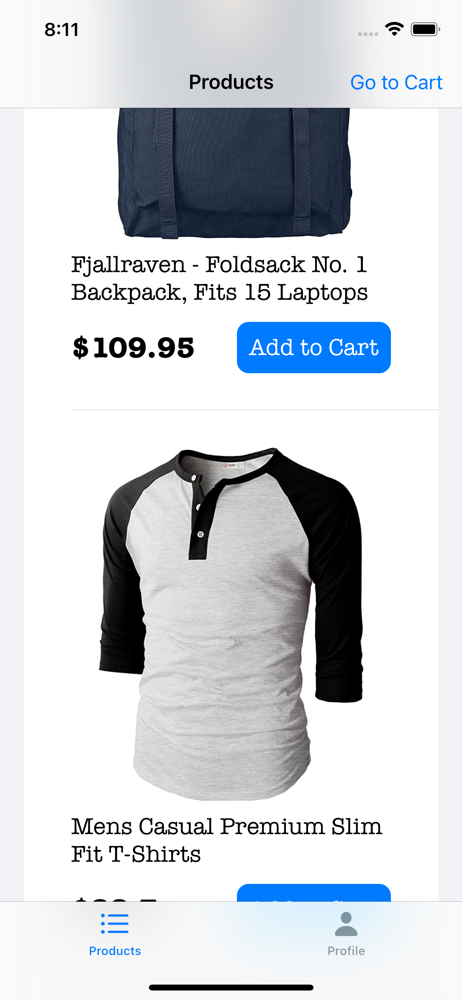
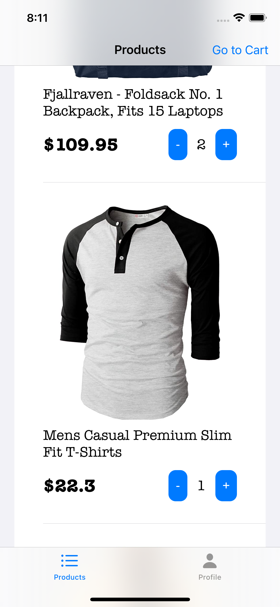
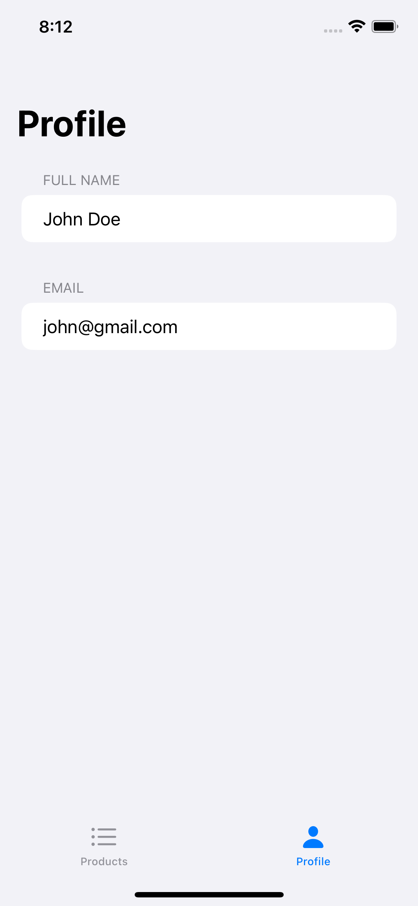
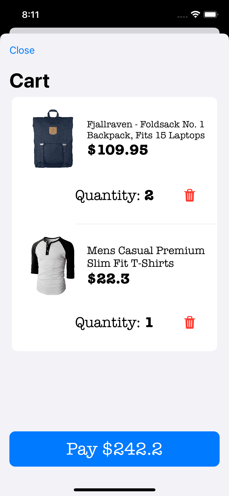
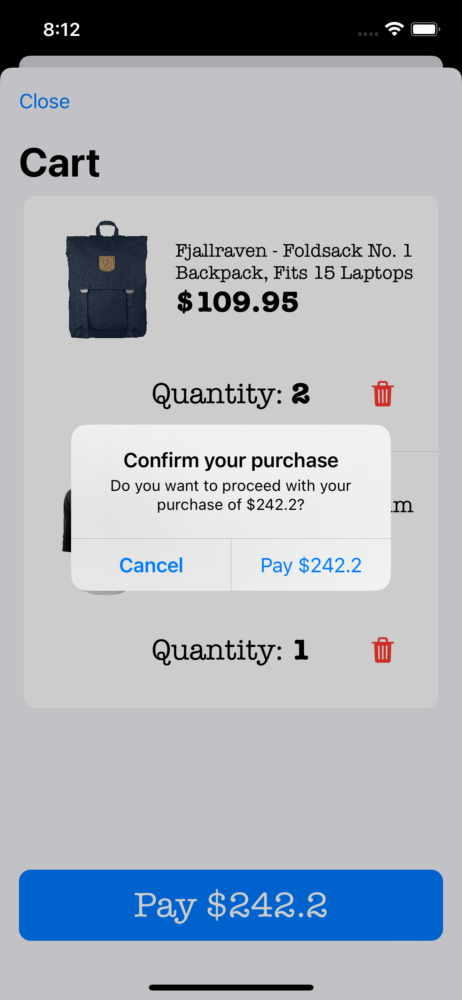
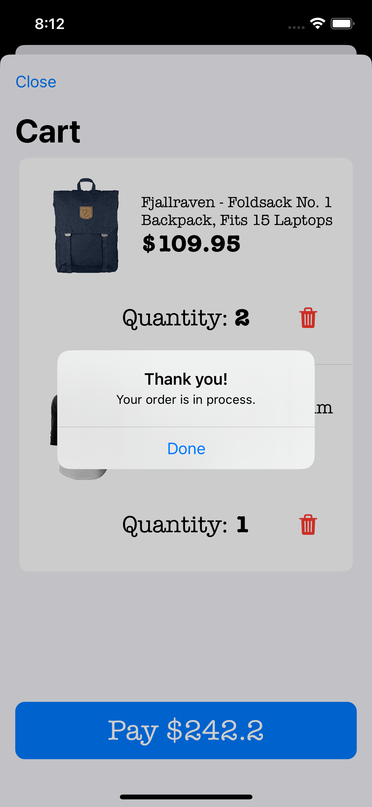
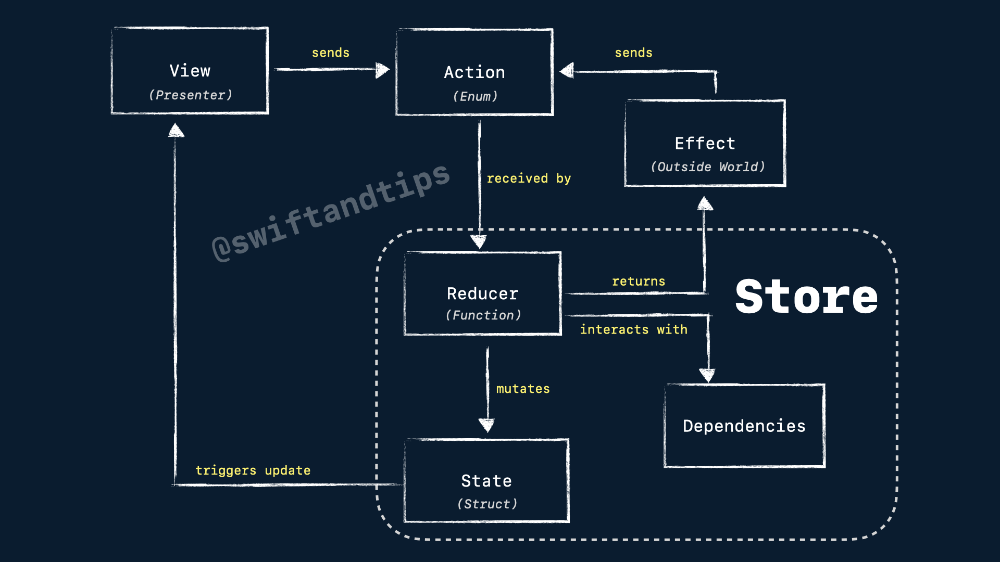
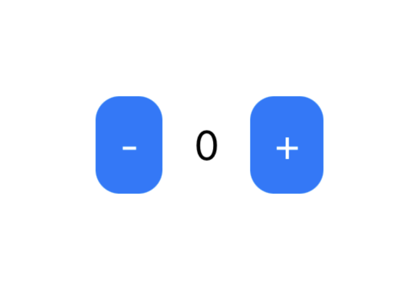
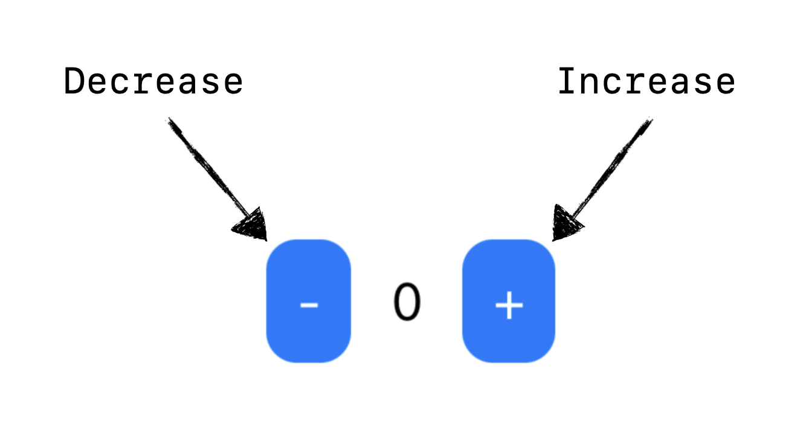
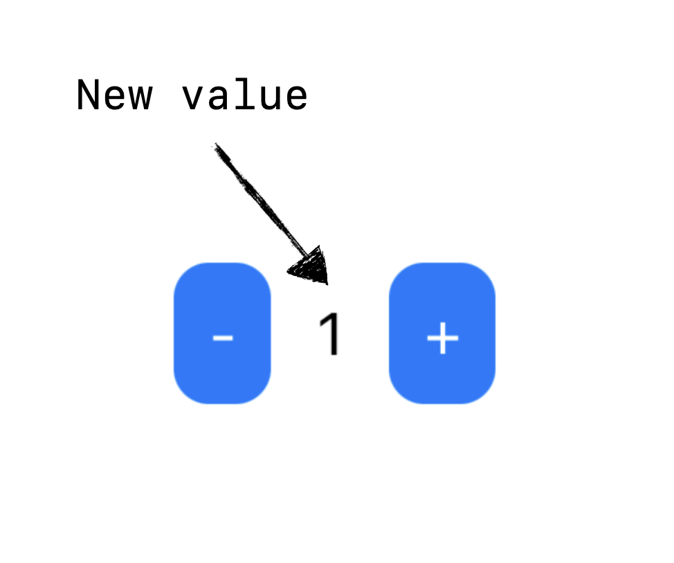

# 목표

- https://github.com/pitt500/OnlineStoreTCA 베끼기
- 1주일(2025.06.19 ~ 2025.06.26)동안 학습
- README.md 번역

---

## Content

* [Motivation](#motivation)
* [Screenshots of the app](#screenshots)
* [The basics](#the-basics)
    * [Archiecture Diagram](#archiecture-diagram)
    * [Hello World Example](#hello-world-example)
* [Composition](#composition)
    * [Body to compose multiple Reducers](#body-to-compose-multiple-reducers)
    * [Single state operators](#single-state-operators)
      * [store.scope(state:action:)](#storescopestateaction)
      * [Scope in Reducers](#scope-in-reducers)
    * [Collection of states](#collection-of-states)
      * [forEach in Reducer](#foreach-in-reducer)
* [Dependencies](#dependencies)
* [Side Effects](#side-effects)
    * [Network Calls](#network-calls)
* [Navigation](#navigation)
    * [Alerts](#alerts)
    * [Sheets](#sheets)
* [Testing](#testing)
    * [Basics](#testing-basics)
    * [Side Effects](#testing-side-effects)
    * [CasePathable](#testing-CasePathable)
* [Other Topics](#other-topics)
    * [Optional States](#optional-states)
    * [Private Actions](#private-actions)
    * [Making a Root Domain with Tab View](#making-a-root-domain-with-tab-view)
* [Contact](#contact)

## Motivation

**TL;DR:** This project aims to build an app using TCA, striking a balance between simplicity and complexity. It focuses on exploring the most important use cases of TCA while providing concise and accessible documentation for new learners. The goal is to create a valuable learning resource that offers practical insights into using TCA effectively. 
**요약:** 이 프로젝트는 TCA를 활용하여 단순성과 복잡성의 균형을 맞춘 앱을 개발하는 것을 목표로 합니다. TCA의 가장 중요한 사용 사례를 살펴보는 동시에 신규 학습자를 위해 간결하고 접근하기 쉬운 문서를 제공하는 데 중점을 둡니다. TCA를 효과적으로 사용하는 데 필요한 실질적인 통찰력을 제공하는 귀중한 학습 자료를 만드는 것이 목표입니다. 
 
I aimed to showcase the power of the TCA architecture in building robust applications for the Apple ecosystem, including iOS, macOS, and more excitingly, its future expansion beyond the Apple world! 🚀 
저는 iOS, macOS를 포함한 Apple 생태계에서 강력한 애플리케이션을 구축하는 데 있어 TCA 아키텍처의 힘을 보여주고, 더 나아가 Apple 세계를 넘어 미래로 확장하는 데 있어 TCA 아키텍처의 힘을 보여주고 싶었습니다! 🚀 
 
While there are many articles available that demonstrate simple one-screen applications to introduce TCA's core concepts, I noticed a gap between these basic demos and real-world applications like [isoword](https://github.com/pointfreeco/isowords), which can be complex and challenging to understand certain important use cases (like navigation and how reducers are glued). 
TCA의 핵심 개념을 소개하는 간단한 단일 화면 애플리케이션을 보여주는 문서가 많이 있지만, 이러한 기본 데모와 [isoword](https://github.com/pointfreeco/isowords)와 같은 실제 애플리케이션 사이에 차이가 있다는 것을 발견했습니다. 이러한 실제 애플리케이션은 복잡하고 특정 중요한 사용 사례(예: 탐색 및 리듀서의 결합 방식)를 이해하기 어려울 수 있습니다. 
 
In this demo, I have implemented a minimal online store that connects to a real network API (https://fakestoreapi.com). It features a product list, the ability to add items to the cart, and the functionality to place orders. While the requests are not processed in real-time (as it uses a fake API), the network status is simulated, allowing you to experience the interaction and mapping of network calls using TCA. 
이 데모에서는 실제 네트워크 API(https://fakestoreapi.com)에 연결되는 간단한 온라인 스토어를 구현했습니다. 제품 목록, 장바구니에 상품 추가, 주문 기능을 제공합니다. 요청은 실시간으로 처리되지 않지만(가짜 API를 사용하므로), 네트워크 상태는 시뮬레이션되어 TCA를 사용한 네트워크 호출의 상호작용 및 매핑을 경험할 수 있습니다. 
  
While this demo may not be a full-scale real-world application, it includes enough reducers to illustrate how data can be effectively connected and how domains can be isolated to handle specific components within the app (e.g., Tabs -> Product List -> Product Cell -> Add to Cart button). 
이 데모는 실제 세상의 전체적인 애플리케이션은 아니지만, 데이터를 효과적으로 연결하는 방법과 앱 내의 특정 구성 요소를 처리하기 위해 도메인을 분리하는 방법을 보여주는 데 충분한 리듀서가 포함되어 있습니다(예: 탭 -> 제품 목록 -> 제품 셀 -> 장바구니에 추가 버튼).
 
Furthermore, I have created tests to demonstrate one of TCA's key features: ensuring that tests fail if the expected state mutations are not captured accurately. This showcases how TCA promotes testability and helps ensure the correctness of your application. 
또한, TCA의 핵심 기능 중 하나인 예상되는 상태 변화가 정확하게 포착되지 않으면 테스트가 실패하도록 하는 테스트를 만들었습니다. 이는 TCA가 테스트 가능성을 높이고 애플리케이션의 정확성을 보장하는 데 어떻게 도움이 되는지 보여줍니다. 
 
If you're looking to dive into TCA, this demo provides a valuable middle ground between simple examples and complex projects, offering concise documentation and practical insights into working with TCA in a more realistic application setting. 
TCA에 대해 자세히 알아보고 싶다면 이 데모는 간단한 예제와 복잡한 프로젝트 사이의 귀중한 중간 지점을 제공하며, 간결한 설명서와 보다 현실적인 애플리케이션 설정에서 TCA를 사용하는 방법에 대한 실질적인 통찰력을 제공합니다. 
 
## Screenshots

### Tabs
||

### Cart
||

## The basics
### Archiecture Diagram


### Hello World Example
Consider the following implementation of a simple app using TCA, where you will have two buttons: one to increment a counter displayed on the screen and the other to decrement it. 
TCA를 사용하여 간단한 앱을 구현해 보겠습니다. 여기에는 두 개의 버튼이 있습니다. 하나는 화면에 표시된 카운터를 증가시키는 버튼이고, 다른 하나는 감소시키는 버튼입니다. 
 
Here's an example of how this app would be coded with TCA: 
다음은 TCA를 사용하여 이 앱을 코딩하는 방법의 예입니다. 
 
1. A struct that will represent the domain of the feature. This struct must conform `ReducerProtocol` protocol and providing `State` struct, `Action` enum and `reduce` method. 
1. 기능의 도메인을 나타내는 구조체입니다. 이 구조체는 `ReducerProtocol` 프로토콜을 준수해야 하며 `State` 구조체, `Action` 열거형, 그리고 `reduce` 메서드를 제공해야 합니다. 
 
```swift
struct CounterDomain: ReducerProtocol {
    struct State {
        // 기능의 상태 (State of the feature)
    }

    enum Action {
        // 앱에서 할 수 있는 작업 (actions that use can do in the app)
    }
    
    func reduce(into state: inout State, action: Action) -> EffectTask<Action> {
        // Method that will mutate the state given an action.
        // 동작(action)이 주어졌을 때 상태(state)를 변경하는 메서드입니다.
    }
}
```

2. The view that is presented in the screen will display the current state of the app. 
2. 화면에 표시되는 뷰는 앱의 현재 상태(state)를 표시합니다.
<!-- [-] 0 [+] -->


```swift
struct State: Equatable {
    var counter = 0
}
```

3. When the user presses a button (let's say increase button), it will internally send an action to the store. 
3. 사용자가 버튼(예를 들어 증가 버튼)을 누르면 내부적으로 스토어에 작업(action)이 전송됩니다.


```swift
enum Action: Equatable {
    case increaseCounter
    case decreaseCounter
}
```
 
4. The action will be received by the reducer and proceed to mutate the state. Reducer MUST also return an effect, that represent logic from the "outside world" (network calls, notifications, database, etc). If no effect is needed, just return `EffectTask.none` .
4. 액션은 리듀서(현재 상태와 액션을 받아 새로운 상태를 반환하는 순수 함수)에 의해 수신되어 상태를 변경합니다. 리듀서는 "외부 세계"(네트워크 호출, 알림, 데이터베이스 등)의 로직을 나타내는 이펙트(effect)도 반환해야 합니다. 이펙트가 필요하지 않으면 `EffectTask.none`을 반환하면 됩니다.
 - 비순수 작업은 이펙트를 통해 따로 실행하게끔 분리
 - 예) 리듀서는 네트워크 요청 자체를 수행하지 않고, “이런 요청을 수행하라”는 명령(Task)을 반환
  - 리듀서는 여전히 순수함수로 유지 (상태만 변경하고, 이펙트를 기술만 함)
```swift
func reduce(into state: inout State, action: Action) -> EffectTask<Action> {
    switch action {
    case .increaseCounter:
        state.counter += 1 // 상태 변경
        return .none // 이펙트 반환 (아무것도 안함)
    case .decreaseCounter:
        state.counter -= 1
        return .none
    }
}
```

5. Once the mutation is done and the reducer returned the effect, the view will render the update in the screen. 
5. 변형(mutation)이 완료되고 리듀서가 효과를 반환하면 뷰는 화면에 업데이트를 렌더링합니다. 
<!-- [-] 1 [+] -->


6. To observe state changes in TCA, we need an object called `viewStore`, that in this example is wrapped within WithViewStore view. We can send an action from the view to the store using `viewStore.send()` and an `Action` value. 
6. TCA에서 상태 변경을 관찰하려면 `viewStore`라는 객체가 필요합니다. 이 예제에서는 이 객체가 WithViewStore 뷰로 래핑됩니다. `viewStore.send()`와 `Action` 값을 사용하여 뷰에서 스토어로 액션을 전송할 수 있습니다. 

```swift
struct ContentView: View {
    let store: Store<State, Action> // 상태와 작업을 저장하는 스토어

    var body: some View {
        WithViewStore(self.store) { viewStore in
            HStack {
                Button {
                    viewStore.send(.decreaseCounter) // decreaseCounter 액션을 전송
                } label: {
                    Text("-")
                        .padding(10)
                        .background(.blue)
                        .foregroundColor(.white)
                        .cornerRadius(10)
                }
                .buttonStyle(.plain)

                Text(viewStore.counter.description) // counter 값을 표시?
                    .padding(5)

                Button {
                    viewStore.send(.increaseCounter) // increaseCounter 액션을 전송
                } label: {
                    Text("+")
                        .padding(10)
                        .background(.blue)
                        .foregroundColor(.white)
                        .cornerRadius(10)
                }
                .buttonStyle(.plain)
            }
        }
    }
}
```

7. View is initialized by a `Store` object. 
7. View는 `Store` 객체에 의해 초기화됩니다. 

```swift
ContentView(
    store: Store(
        initialState: CounterDomain.State(),
        reducer: CounterDomain()
    )
)
```

